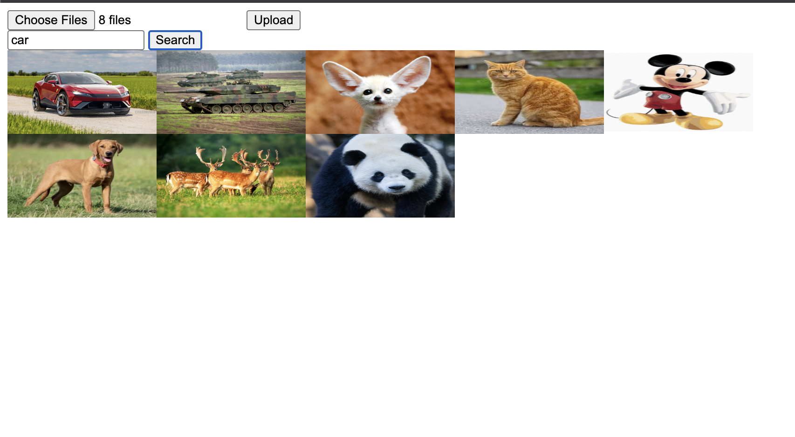
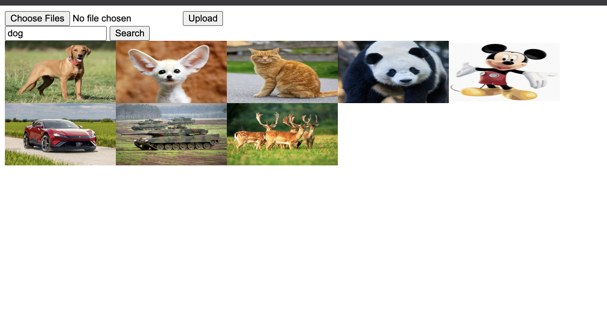
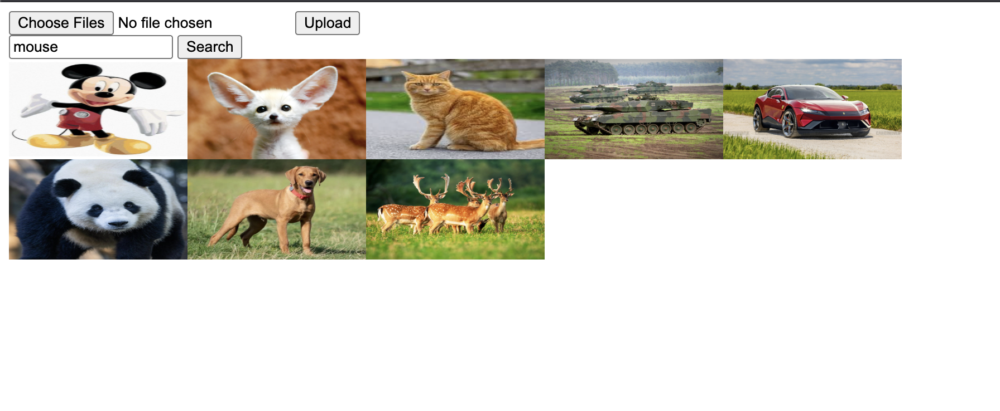

# Image Gallery with Semantic Search - Proof of Concept

This is a proof of concept, that showcases the use of semantic search in an image gallery.

### This is how it works

1. Upload an image to the gallery
2. The image gets asynchronously processed by the worker, that feeds the machine learning model the image and returns vectors
3. The vectors get stored in the database for searching
4. When a user searches for an image, the query gets processed again by the model, and the vectors get compared with the stored ones in the database
5. The images with the highest similarity to the query get returned to the user

## How to run it

you can run the project using `docker compose up --build`

## Example

Example with a car:


Example with a dog:


Example with a mouse:


## Api docs

### GET /api/v1/images

Request:
```
GET /api/v1/images?query=a%20car
```

Response:

```json
{
    "images": [
        {
            "id": "...",
            "imageUrl": "https://example.com/image1.jpg",
        },
        {
            "id": "...",
            "imageUrl": "https://example.com/image2.jpg",
        }
    ]
}
```

### Post /api/v1/upload

request:

```
POST /api/v1/upload
Content-Type: multipart/form-data

Content-Disposition: form-data; name="images"; filename="image.jpg"
Content-Type: image/jpeg
```

response:

```json
{
    "errors": 0,
    "images": [
        {
            "id": "...",
            "imageUrl": "https://example.com/image1.jpg",
        }
    ]
}
```
